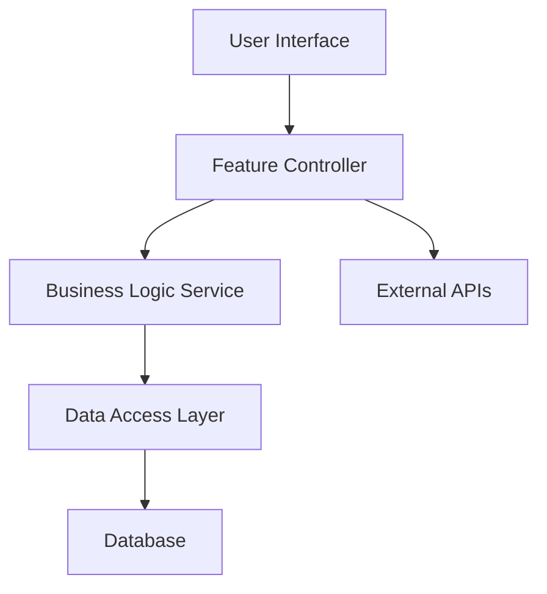

# Generic Feature Template

## Feature Information

```yaml
---
feature: [Feature Name]
priority: [P0/P1/P2]
dependencies: [List of prerequisite features]
estimated_effort: [Story points or time estimate]
feature_type: [auth/dashboard/api/ui/generic]
---
```

## Requirements Template

### Overview

**Feature Description:** [Brief description of feature purpose]
**Business Value:** [Why this feature matters]
**Success Metrics:** [How success will be measured]

### User Stories

#### Epic: [Epic Name]

As a [user type], I want [high-level capability] so that [business value].

#### Story 1: [Story Name]

**Priority:** P0 | **Effort:** [X points] | **Dependencies:** [None/Feature X]

**User Story:**
As a [specific persona], I want [functionality] so that [benefit].

**Acceptance Criteria:**
WHEN [trigger condition]
THE SYSTEM SHALL [required behavior]
WHERE [applicable constraints]

### Non-Functional Requirements

#### Performance Requirements

- Page load time: < 2 seconds
- API response time: < 200ms
- Concurrent users: Support 1000+ simultaneous users

#### Security Requirements

- Data encryption in transit and at rest
- Authentication and authorization controls
- Input validation and sanitization

#### Accessibility Requirements

- WCAG 2.1 AA compliance
- Keyboard navigation support
- Screen reader compatibility

#### Compatibility Requirements

- Browser support: Chrome 90+, Firefox 88+, Safari 14+
- Mobile responsive design
- Touch-friendly interface

### Business Rules

1. **Rule 1:** [Description and rationale]
2. **Rule 2:** [Description and rationale]

### Integration Requirements

**Upstream Dependencies:**

- [Feature/System that this depends on]

**Downstream Impacts:**

- [Features/Systems that depend on this]

### Success Criteria

**Primary KPIs:**

- [Metric 1]: [Target and measurement method]
- [Metric 2]: [Target and measurement method]

**User Experience Metrics:**

- User satisfaction score: > 4.0/5.0
- Task completion rate: > 90%
- Error rate: < 5%

### Out of Scope

- [What is explicitly not included in this feature]
- [Future enhancements to consider later]

### Assumptions

- [Key assumptions about user behavior, technical constraints, etc.]

### Risks & Mitigation

**Risk 1:** [Description]
**Mitigation:** [Specific mitigation strategy]

## Design Template

### Architecture Overview

#### System Context



### Component Architecture

#### Frontend Components

```
FeaturePage/
├── containers/
│   ├── FeatureContainer.jsx     # Main container component
│   └── FeatureFormContainer.jsx # Form handling container
├── components/
│   ├── FeatureList.jsx          # Display component
│   ├── FeatureItem.jsx          # Individual item component
│   └── FeatureForm.jsx          # Form component
├── hooks/
│   ├── useFeatureData.js        # Data fetching hook
│   └── useFeatureForm.js        # Form management hook
└── services/
    └── featureApi.js            # API integration
```

### Data Architecture

#### Data Models

```typescript
// Feature-specific models
interface FeatureData {
  id: string;
  userId: string;
  data: FeaturePayload;
  status: "active" | "inactive";
  createdAt: Date;
}
```

#### Database Schema

```sql
-- Feature-specific tables
CREATE TABLE feature_data (
  id UUID PRIMARY KEY DEFAULT gen_random_uuid(),
  user_id UUID REFERENCES users(id),
  data JSONB NOT NULL,
  status VARCHAR(20) DEFAULT 'active',
  created_at TIMESTAMP DEFAULT NOW()
);
```

### API Specification

#### Endpoints

```yaml
# Feature endpoints
GET /api/features
  Response: { features: FeatureData[] }

POST /api/features
  Request: { data: FeaturePayload }
  Response: { feature: FeatureData }

PUT /api/features/:id
  Request: { data: Partial<FeaturePayload> }
  Response: { feature: FeatureData }

DELETE /api/features/:id
  Response: { success: boolean }
```

### Security Architecture

- **JWT Token-based authentication**
- **Role-based access control (RBAC)**
- **API rate limiting and throttling**
- **Input validation and sanitization**

### Performance Architecture

- **Database query optimization with indexing**
- **Caching strategy using Redis**
- **API response compression**
- **Frontend code splitting and lazy loading**

## Tasks Template

### Implementation Plan

#### Phase 1: UX/UI Development with Mock Data

**Goal:** Create functional user interface with fake data to validate UX flows

- [ ] 1.1 Create feature directory structure
- [ ] 1.2 Create mock data and services
- [ ] 1.3 Build foundational components
- [ ] 1.4 Build container components
- [ ] 1.5 Set up feature routing

#### Phase 2: UI Styling & Design System Integration

**Goal:** Apply visual design and ensure consistency with design system

- [ ] 2.1 Apply design system styles
- [ ] 2.2 Style individual components
- [ ] 2.3 Implement responsive behavior
- [ ] 2.4 Ensure accessibility compliance

#### Phase 3: Core Functionality Implementation

**Goal:** Implement business logic and core feature functionality

- [ ] 3.1 Implement global state management
- [ ] 3.2 Build core feature logic
- [ ] 3.3 Implement robust form management
- [ ] 3.4 Implement comprehensive error handling

#### Phase 4: Backend API Integration

**Goal:** Replace mock data with real API integration

- [ ] 4.1 Create backend API endpoints
- [ ] 4.2 Set up database layer
- [ ] 4.3 Connect frontend to backend APIs
- [ ] 4.4 Implement security measures

#### Phase 5: Data Management & Performance

**Goal:** Optimize data handling and application performance

- [ ] 5.1 Implement efficient data management
- [ ] 5.2 Optimize application performance
- [ ] 5.3 Optimize database operations

#### Phase 6: Quality Assurance & Testing

**Goal:** Ensure feature quality through comprehensive testing

- [ ] 6.1 Conduct thorough manual testing
- [ ] 6.2 Address quality issues
- [ ] 6.3 Validate performance requirements

#### Phase 7: Automated Testing Implementation

**Goal:** Implement comprehensive automated test suite

- [ ] 7.1 Write unit tests for components and functions
- [ ] 7.2 Write integration tests for feature workflows
- [ ] 7.3 Write E2E tests for critical user journeys
- [ ] 7.4 Set up testing infrastructure

#### Phase 8: Documentation & Deployment Preparation

**Goal:** Complete documentation and prepare for production deployment

- [ ] 8.1 Document code and architecture
- [ ] 8.2 Create user-facing documentation
- [ ] 8.3 Prepare for production deployment
- [ ] 8.4 Plan feature release and rollout

### Dependencies & Prerequisites

- [ ] **Prerequisite 1:** [Feature/System that must be completed first]
- [ ] **Prerequisite 2:** [Infrastructure or service that must be available]

### Success Criteria

- [ ] All automated tests pass with >80% code coverage
- [ ] Performance requirements met (load time <2s, API response <200ms)
- [ ] Accessibility requirements met (WCAG 2.1 AA compliance)
- [ ] Feature meets all acceptance criteria in requirements
