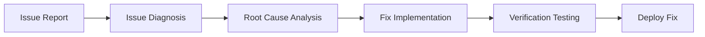

# SpecOS - Unified Specification-Driven Development System

> **⚠️ Important Notice: This project has moved to a new repository**
>
> This project has been moved to [https://github.com/rainday/specOS](https://github.com/rainday/specOS)
>
> Please visit the new repository for the latest version and updates. This repository will no longer be maintained.

[](https://github.com/rainday/specOS)
[](LICENSE)
[](https://claude.ai/code)

## Overview

SpecOS is a unified specification-driven development system that integrates the core functionality of Spec-Driven development into a single main agent, providing a complete development experience through standardized commands and agents.

## Core Features

### 🎯 Unified Agent Architecture

- Single main agent handles all development needs
- Modular commands and agent system
- Standardized command shortcuts

### 📋 Specification-Driven Development

- Structured workflow based on specification-driven development
- Standardized document templates and development standards
- Clear task breakdown and progress tracking

### ⚡ Lightweight Design

- Minimal resource consumption
- Fast response and execution
- Clean user interface

## Quick Start

### 1. Download Source Code

```bash
# Clone repository
git clone https://github.com/rainday/specOS.git
cd specOS

# Or download ZIP file
curl -L https://github.com/rainday/specOS/archive/main.zip -o specOS.zip
unzip specOS.zip
cd specOS-main
```

### 2. Install SpecOS

```bash
# Global installation (recommended)
./setup-specos.sh --global

# Project-level installation
./setup-specos.sh --project

# Hybrid installation (recommended)
./setup-specos.sh --global --project

# View manual installation instructions
./setup-specos.sh --manual
```

### 3. Start Using

```bash
# Start Claude Code
claude

# Edit project notes (important!)
# Edit the .specos/docs/plan-note.md file to record your project information

# Use SpecOS commands
/plan-product    # Plan product based on project notes
/create-spec     # Create feature specifications
/execute-tasks   # Execute development tasks
/analyze-product # Analyze existing codebase
/fix-bugs        # Fix code errors
/code-review     # Code review
/build-bp        # Build business plan
```

## System Architecture

### Core Components

```
specos/
├── agent/                    # Main agent system
│   └── specos-agent.md      # Unified main agent
├── tools/                   # Development tools
│   ├── analyze-product.md   # Product analysis
│   ├── create-spec.md       # Create specifications
│   ├── execute-tasks.md     # Execute tasks
│   ├── fix-bugs.md          # Fix errors
│   ├── code-review.md       # Code review
│   └── build-bp.md          # Build business plan
├── rules/                   # Development rules
│   ├── tech.md             # Technology stack
│   ├── code-style.md       # Code style
│   ├── structure.md        # Project structure
│   ├── style-guide.md      # Style guide
│   └── best-practices.md   # Best practices
└── commands/               # Shortcut commands
    ├── plan-product.md     # Plan product
    ├── create-spec.md      # Create specifications
    ├── execute-tasks.md    # Execute tasks
    ├── analyze-product.md  # Analyze product
    ├── fix-bugs.md         # Fix errors
    ├── code-review.md      # Code review
    └── build-bp.md         # Build business plan
```

### Installation Locations

#### Global Installation

- `~/.specos/` - SpecOS global configuration
- `~/.claude/` - Claude Code global configuration

#### Project-Level Installation

- `project-root/.specos/` - Project-level SpecOS configuration
- `project-root/.claude/` - Project-level Claude Code configuration

## Usage Guide

### Project Notes System

The core of SpecOS is the project notes system. Before using any commands, please first edit the `docs/plan-note.md` file:

#### 1. Edit Project Notes

```bash
# Edit project notes file
nano .specos/docs/plan-note.md
# Or use your preferred editor
code .specos/docs/plan-note.md
```

#### 2. Record Project Information

In `plan-note.md`, record:

- Basic project information (name, type, target users)
- Functional requirements (main features, secondary features)
- Technical preferences (technology stack, special requirements)
- Business considerations (market, competition, revenue model)
- User feedback (needs, pain points)
- Project progress (current status, completed items)

#### 3. Continuous Updates

As the project develops, continuously update project notes:

- Add new requirements or ideas
- Record user feedback
- Update technical decisions
- Supplement business information

### Basic Commands

```bash
# Plan product based on project notes
/plan-product "E-commerce Platform"

# Create feature specifications
/create-spec "User Authentication System"

# Execute development tasks
/execute-tasks

# Analyze existing codebase
/analyze-product

# Fix code errors
/fix-bugs "Login failure issue"

# Code review
/code-review

# Build business plan
/build-bp
```

### Workflow Examples

#### New Project Startup

```bash
# 1. Edit project notes
nano .specos/docs/plan-note.md

# 2. Record initial ideas
# Record basic project information in plan-note.md

# 3. Generate product plan
/plan-product

# 4. Create detailed specifications
/create-spec "Core Features"

# 5. Start development
/execute-tasks
```

#### Existing Project Improvement

```bash
# 1. Update project notes
# Add new user feedback in plan-note.md

# 2. Re-plan product
/plan-product "Update plan based on new feedback"

# 3. Analyze existing code
/analyze-product

# 4. Create new feature specifications
/create-spec "New Feature"

# 5. Execute development
/execute-tasks
```

### Natural Language Interaction

```bash
# Directly describe requirements
"Help me create a product specification for an e-commerce platform"
"Analyze the existing user authentication system"
"Fix errors in the login functionality"
"Review the code quality of the user module"
```

## Configuration Options

### Global Configuration (`~/.specos/config.yaml`)

```yaml
specos:
  version: "1.0.0"
  installation_type: "global"

  # Feature configuration
  features:
    auto_backup: true
    auto_update: true
    verbose_logging: false

  # Tool configuration
  tools:
    analyze_product: true
    create_spec: true
    execute_tasks: true
    fix_bugs: true
    code_review: true
    build_bp: true
```

### Project-Level Configuration (`project-root/.specos/config.yaml`)

```yaml
specos:
  version: "1.0.0"
  installation_type: "project"
  project_name: "my-project"

  # Project-specific configuration
  project:
    language: "typescript"
    framework: "react"
    package_manager: "npm"
```

## Development Workflow

### 1. Product Planning Phase


### 2. Feature Development Phase


### 3. Issue Resolution Phase



## Best Practices

### 1. File Organization

- Separate template files from installation scripts
- Use relative path references
- Support multiple installation methods
- Provide clear documentation

### 2. Configuration Management

- Separate global and project-level configurations
- Support environment variable overrides
- Provide configuration validation
- Support configuration backup and recovery

### 3. Installation Process

- Support manual and automatic installation
- Provide installation options
- Check dependencies
- Provide error handling

### 4. Version Management

- Support version checking
- Provide update mechanisms
- Support rollback
- Maintain update logs

## Troubleshooting

### Common Issues

1. **Claude Code cannot recognize commands**

   - Ensure `CLAUDE.md` is in the correct location
   - Check file permissions
   - Restart Claude Code

2. **File not found**

   - Check if all template files are correctly copied
   - Verify directory structure
   - Re-run installation script

3. **Permission errors**
   - Ensure write permissions to target directories
   - Check user permissions
   - Use `sudo` to run installation script

### Verify Installation

```bash
# Check global installation
ls -la ~/.specos/
ls -la ~/.claude/

# Check project-level installation
ls -la .specos/
ls -la .claude/

# Test Claude Code integration
claude --help
```

## Contributing

### Development Environment Setup

```bash
# Clone repository
git clone https://github.com/rainday/specOS.git
cd specOS

# Install dependencies
# (if there are any dependencies)

# Run tests
# (if there are test scripts)
```

### Commit Standards

- Use [Conventional Commits](https://www.conventionalcommits.org/)
- Provide clear commit messages
- Include relevant tests and documentation updates

### Issue Reporting

- Use GitHub Issues
- Provide detailed issue descriptions
- Include reproduction steps and environment information

## License

This project is licensed under the [MIT License](LICENSE).

## Related Links

- [Claude Code Documentation](https://claude.ai/code)
- [Claude Code Best Practices](https://www.anthropic.com/engineering/claude-code-best-practices)

## Changelog

See [CHANGELOG.md](CHANGELOG.md) for details.

---

**SpecOS** - Unified specification-driven development system, making AI-assisted development more efficient and standardized.
