[](https://github.com/rainday/spec-driven-claude-code/blob/main/README.md)
[](https://github.com/rainday/spec-driven-claude-code/blob/main/README.zh-TW.md)
[](https://github.com/rainday/spec-driven-claude-code/blob/main/README.zh-CN.md)
[](https://github.com/rainday/spec-driven-claude-code/blob/main/README.ja.md)

# Spec-Driven Claude Code

A powerful code agent built on Kiro spec-driven development principles, designed to streamline software development workflows through intelligent automation and systematic task management.

## 🌟 Features

### Core Components

- **David (PRD Writer)**: Expert Product Requirements Document generator with guided workflow
- **Sarah (BP Builder)**: Comprehensive Business Plan builder and strategic planning specialist
- **Daniel (Rules Architect)**: Project governance and documentation architect
- **James (Strategic Planner)**: Software architect and collaborative planning specialist
- **Emily (Task Executor)**: High-performance AI software engineer for rapid task execution
- **Bug Fixer**: Expert debugging and troubleshooting specialist
- **Code Reviewer**: Professional code review expert for quality assurance

## 🔄 Complete Workflow

```mermaid
graph TD
    A[💡 Business Idea] --> B[📋 Sarah - BP Builder]
    B --> C[📝 David - PRD Writer]
    C --> D[🏗️ Daniel - Rules Architect]
    D --> E[📊 James - Strategic Planner]
    E --> F[⚡ Emily - Task Executor]
    F --> G[🐛 Bug Fixer]
    G --> H[🔍 Code Reviewer]
    H --> I[✅ Production Ready]

    %% Feedback loops
    G --> F
    H --> F
    I --> C

    %% Parallel processes
    B --> E
    C --> E
    D --> E

    %% Quality gates
    F --> G{Issues?}
    G -->|Yes| G
    G -->|No| H
    H -->|Fail| F
    H -->|Pass| I

    %% Styling
    classDef business fill:#e1f5fe
    classDef planning fill:#f3e5f5
    classDef execution fill:#e8f5e8
    classDef quality fill:#fff3e0

    class A,B business
    class C,D,E planning
    class F execution
    class G,H quality
```



### Workflow Phases

1. **Business Planning Phase**: Sarah creates comprehensive business plans
2. **Requirements Phase**: David generates detailed Product Requirements Documents
3. **Governance Phase**: Daniel establishes project rules and architecture
4. **Strategy Phase**: James develops technical roadmaps and implementation plans
5. **Execution Phase**: Emily implements features with surgical precision
6. **Quality Assurance**: Bug Fixer and Code Reviewer ensure code quality
7. **Deployment**: Production-ready code with comprehensive testing

## 🤖 Agent Details

### 📋 Sarah - BP Builder Agent

**Purpose**: Expert Business Plan builder and strategic planning specialist

**Key Capabilities**:

- Creates comprehensive, investor-ready business plans
- Performs market analysis and competitive intelligence
- Develops financial projections and funding strategies
- Provides go-to-market strategies and risk assessment

**Usage Examples**:

```bash
# Guided business plan creation
@bp-builder --guided

# Industry-specific business plan
@bp-builder --industry=saas "Create business plan for B2B project management platform"

# Quick business plan generation
@bp-builder "Create a business plan for a mobile fitness app targeting busy professionals"
```

**What It Delivers**:

- Complete business plan document with all sections
- Financial models and projections
- Market research and competitive analysis
- Risk assessment and mitigation strategies
- Investor pitch materials and executive summaries

### 📝 David - PRD Writer Agent

**Purpose**: Expert Product Requirements Document generator with guided workflow

**Key Capabilities**:

- Transforms ideas into comprehensive, actionable product specifications
- Creates user stories, acceptance criteria, and technical requirements
- Supports both new and existing projects with intelligent context detection
- Integrates with business plans for strategic alignment

**Usage Examples**:

```bash
# Guided workflow for new users
@prd-writer --guided

# Quick PRD generation
@prd-writer "Create a PRD for a mobile app that helps users track their fitness goals"

# Project-specific PRD
@prd-writer --project="existing" "Add user authentication feature to our app"
```

**What It Creates**:

- Comprehensive PRD in `.claude/docs/prd.md`
- User stories and acceptance criteria
- Technical specifications and implementation roadmaps
- Business analysis and stakeholder communication materials

### 🏗️ Daniel - Rules Architect Agent

**Purpose**: Expert project analyst and documentation architect specializing in codebase analysis

**Key Capabilities**:

- Analyzes existing projects to extract technical architecture
- Creates comprehensive project governance files (.claude/rules/)
- Establishes product vision, organizational structure, and design systems
- Provides standardized governance documentation for AI agents and teams

**Usage Examples**:

```bash
# Default foundation setup
@Daniel --setup=default --guided

# Enterprise-level governance
@Daniel --setup=enterprise --guided

# Analyze existing project
@Daniel --analyze --guided
```

**What It Creates**:

- `.claude/rules/product.md` - Product vision and feature guidelines
- `.claude/rules/tech.md` - Technology stack and technical standards
- `.claude/rules/structure.md` - Project organization and file structure
- `.claude/rules/style-guide.md` - UI/UX design system and standards
- `.claude/rules/development.md` - Development workflows and processes

### 📊 James - Strategic Planner Agent

**Purpose**: Expert software architect and collaborative planning specialist

**Key Capabilities**:

- Translates business requirements into technical specifications
- Creates detailed feature planning with 8-phase implementation structure
- Manages dependencies and risk assessment
- Provides intelligent project assessment and progress tracking

**Usage Examples**:

```bash
# Check project status
James, status

# Plan new feature
James, plan feature "user-authentication"

# Update existing feature
James, update feature "user-dashboard"

# Batch planning
James, plan batch --features="auth,dashboard,profile"
```

**What It Delivers**:

- Feature requirements, design, and task breakdown
- Project roadmap with phases and milestones
- Dependency analysis and risk assessment
- Progress tracking and completion monitoring

### ⚡ Emily - Task Executor Agent

**Purpose**: High-performance AI software engineer specializing in rapid, precise task execution

**Key Capabilities**:

- Implements features from strategic plans with surgical precision
- Maintains code quality with automated testing and quality checks
- Provides step-by-step user guidance for optimal execution flow
- Tracks progress and manages task dependencies

**Usage Examples**:

```bash
# Execute next task in current feature
@task-executor continue

# Show all available features and tasks
@task-executor scan

# Switch to specific feature
@task-executor feature user-authentication

# Check product requirements
@task-executor product
```

**What It Manages**:

- Task decomposition and prioritization
- Implementation steps and technical specifications
- Dependency management and critical path analysis
- Progress tracking and milestone achievement
- Quality assurance and automated testing

### 🐛 Bug Fixer Agent

**Purpose**: Expert debugging and troubleshooting specialist

**Key Capabilities**:

- Deep expertise in root cause analysis and error investigation
- Systematic problem resolution with scientific debugging methodology
- Comprehensive diagnostic tools and evidence-based solutions
- Automatic activation for errors, test failures, and performance issues

**Usage Examples**:

```bash
# Automatic activation on errors
# Triggered when encountering exceptions, failures, or performance issues

# Manual debugging session
@bug-fixer "Debug the authentication timeout issue"

# Performance analysis
@bug-fixer "Analyze slow database queries"
```

**What It Provides**:

- Systematic error investigation and classification
- Root cause analysis with evidence collection
- Comprehensive debugging reports and resolution plans
- Prevention measures and monitoring enhancements

### 🔍 Code Reviewer Agent

**Purpose**: Professional code review expert specializing in comprehensive quality assessment

**Key Capabilities**:

- Comprehensive quality assessment and security analysis
- Maintainability evaluation and performance optimization
- Structured feedback with actionable recommendations
- Automatic triggering after code modifications

**Usage Examples**:

```bash
# Automatic review after code changes
# Triggered automatically after commits

# Manual code review
@code-reviewer "Review the authentication module"

# Security-focused review
@code-reviewer --security "Security review of payment processing"
```

**What It Assesses**:

- Code quality and readability standards
- Security vulnerabilities and best practices
- Performance optimization opportunities
- Testing coverage and maintainability
- Documentation and compliance requirements

## 🚀 Getting Started

### Prerequisites

- Claude Code installed
- Claude API access
- Project specification requirements

### Installation

1. **Download or Copy Files**

   ```bash
   # Copy the agent files to your .claude/agents directory
   cp -r spec-driven-claude-code/ ~/.claude/agents/
   ```

2. **Restart Claude Code**

   - Close Claude Code completely
   - Restart the application

3. **Access the Agents**

   - Open Claude Code
   - All agents will be available in your agent list

### Usage

Once the agents are loaded, you can follow the complete workflow:

1. **Start with Business Planning**

   ```bash
   @bp-builder --guided
   ```

2. **Generate Product Requirements**

   ```bash
   @prd-writer --guided
   ```

3. **Establish Project Governance**

   ```bash
   @Daniel --setup=default --guided
   ```

4. **Create Strategic Plan**

   ```bash
   James, plan feature "core-features"
   ```

5. **Execute Implementation**

   ```bash
   @task-executor continue
   ```

6. **Quality Assurance**

   - Bug Fixer activates automatically on issues
   - Code Reviewer provides quality assessment

## 🔄 Agent Workflow Integration

### Complete Project Lifecycle

```bash
# 1. Business Planning
@bp-builder --guided
# → Creates comprehensive business plan

# 2. Product Requirements
@prd-writer --guided
# → Creates PRD with business context

# 3. Project Governance
@Daniel --setup=enterprise --guided
# → Establishes project architecture

# 4. Strategic Planning
James, plan feature "user-authentication"
# → Creates detailed implementation plan

# 5. Task Execution
@task-executor continue
# → Implements features with precision

# 6. Quality Assurance
# → Bug Fixer and Code Reviewer ensure quality
```

### Agent Collaboration Examples

**New Startup Project**:

```bash
# Complete startup workflow
@bp-builder --guided
@prd-writer --guided
@Daniel --setup=default --guided
James, plan feature "mvp-features"
@task-executor continue
```

**Existing Project Enhancement**:

```bash
# Feature addition workflow
@prd-writer --project="existing" "Add payment processing"
@Daniel --update=tech
James, plan feature "payment-system"
@task-executor feature payment-system
```

**Enterprise Project Setup**:

```bash
# Enterprise-level workflow
@bp-builder --industry=enterprise --guided
@prd-writer --template=enterprise --guided
@Daniel --setup=enterprise --guided
James, plan batch --features="auth,dashboard,admin,api"
@task-executor autonomous
```

## 📁 Project Structure

```
spec-driven-claude-code/
├── .claude/
│   ├── agents/
│   │   ├── 1.david-prd-writer.md
│   │   ├── 2.daniel-rules-architect.md
│   │   ├── 3.strategic-planner.md
│   │   ├── 4.task-executor.md
│   │   ├── bp-builder.md
│   │   ├── bug-fixer.md
│   │   └── code-reviewer.md
│   ├── rules/
│   │   ├── product.md
│   │   ├── tech.md
│   │   ├── structure.md
│   │   ├── style-guide.md
│   │   └── development.md
│   ├── docs/
│   │   └── prd.md
│   ├── features/
│   │   ├── 1.user-authentication/
│   │   │   ├── requirements.md
│   │   │   ├── design.md
│   │   │   └── tasks.md
│   │   ├── 2.user-dashboard/
│   │   │   ├── requirements.md
│   │   │   ├── design.md
│   │   │   └── tasks.md
│   └── business-plan/
│       └── main-business-plan.md
└── README.md
```

## 🔧 Configuration

### Environment Variables

```env
CLAUDE_API_KEY=your_api_key_here
PROJECT_NAME=your_project_name
ENVIRONMENT=development
```

### Agent Configuration

```json
{
  "agents": {
    "bp_builder": {
      "auto_business_plan": true,
      "industry_templates": ["saas", "fintech", "healthcare"]
    },
    "prd_writer": {
      "guided_workflow": true,
      "templates": ["general", "saas", "mobile", "api"]
    },
    "rules_architect": {
      "governance_level": "enterprise",
      "auto_analysis": true
    },
    "strategic_planner": {
      "planning_mode": "comprehensive",
      "dependency_analysis": true
    },
    "task_executor": {
      "execution_mode": "guided",
      "quality_checks": true
    },
    "bug_fixer": {
      "auto_trigger": true,
      "debugging_level": "comprehensive"
    },
    "code_reviewer": {
      "auto_review": true,
      "security_focus": true
    }
  }
}
```

## 📚 Documentation

- [API Reference](./docs/api.md)
- [Configuration Guide](./docs/configuration.md)
- [Workflow Examples](./docs/examples.md)
- [Troubleshooting](./docs/troubleshooting.md)

## 🤝 Contributing

1. Fork the repository
2. Create a feature branch (`git checkout -b feature/amazing-feature`)
3. Commit your changes (`git commit -m 'Add amazing feature'`)
4. Push to the branch (`git push origin feature/amazing-feature`)
5. Open a Pull Request

## 📄 License

This project is licensed under the MIT License - see the [LICENSE](LICENSE) file for details.

## 🌍 Internationalization

This README is available in multiple languages:

- [English](README.md) (Current)
- [繁體中文](README.zh-TW.md)
- [简体中文](README.zh-CN.md)
- [日本語](README.ja.md)

## 🆘 Support

If you encounter any issues or have questions:

- Create an issue in the GitHub repository
- Check the [troubleshooting guide](./docs/troubleshooting.md)
- Review the [FAQ](./docs/faq.md)

## 🔄 Version History

- **v1.0.0**: Initial release with core functionality
- **v1.1.0**: Added bug fixer and code reviewer
- **v1.2.0**: Enhanced distributed task management
- **v2.0.0**: Complete agent ecosystem with business planning integration

---

**Built with ❤️ using Claude AI and Kiro spec-driven development principles**
