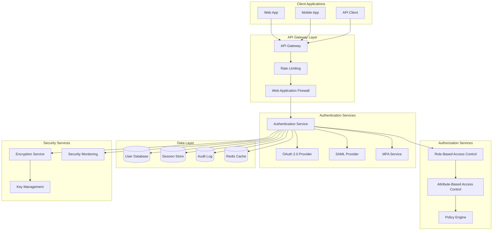
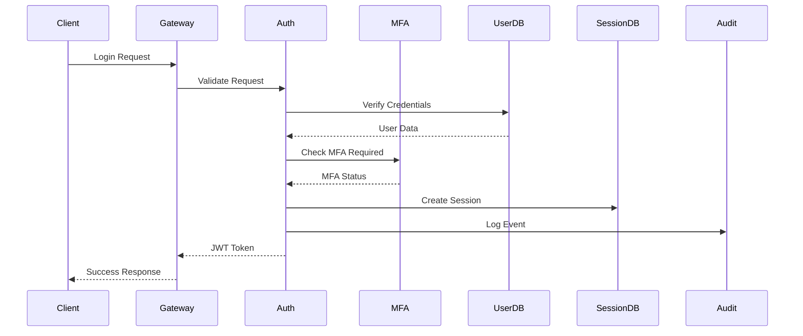
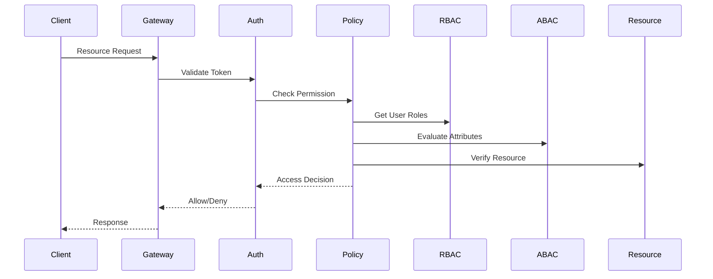

# Technical Strategy: Enterprise User Authentication System

**Project**: Secure User Authentication & Authorization Platform  
**Version**: 1.0  
**Date**: December 2024  
**Prepared by**: James (Strategic Planner Agent)

## 1. Executive Summary

This technical strategy outlines the development of a comprehensive, enterprise-grade user authentication and authorization system designed to serve as the foundation for secure application access across multiple platforms and services.

### 1.1 Strategic Objectives

- **Security First**: Implement industry-leading security practices and compliance standards
- **Scalability**: Support 1M+ concurrent users with sub-second response times
- **Flexibility**: Multi-tenant architecture supporting various authentication methods
- **Compliance**: Meet SOC 2, GDPR, HIPAA, and FedRAMP requirements
- **Developer Experience**: Provide intuitive APIs and comprehensive documentation

### 1.2 Success Metrics

- **Security**: Zero critical security vulnerabilities in production
- **Performance**: 99.99% uptime with <100ms average response time
- **Scalability**: Handle 10,000+ requests per second
- **Compliance**: Achieve all target compliance certifications within 12 months

## 2. Architecture Overview

### 2.1 High-Level Architecture



### 2.2 Technology Stack Selection

#### Frontend Technologies

- **Framework**: React.js with TypeScript
- **State Management**: Redux Toolkit with RTK Query
- **UI Components**: Material-UI (MUI) with custom theme
- **Form Handling**: React Hook Form with Yup validation
- **Testing**: Jest + React Testing Library

#### Backend Technologies

- **Runtime**: Node.js with TypeScript
- **Framework**: Express.js with Express-validator
- **Authentication**: Passport.js with JWT
- **Database ORM**: Prisma with PostgreSQL
- **Caching**: Redis with ioredis
- **Message Queue**: RabbitMQ with amqplib

#### Infrastructure & DevOps

- **Containerization**: Docker with multi-stage builds
- **Orchestration**: Kubernetes with Helm charts
- **Cloud Platform**: AWS (EKS, RDS, ElastiCache, S3)
- **CI/CD**: GitHub Actions with ArgoCD
- **Monitoring**: Prometheus + Grafana + Jaeger
- **Logging**: ELK Stack (Elasticsearch, Logstash, Kibana)

#### Security Technologies

- **Encryption**: AES-256-GCM for data at rest, TLS 1.3 for data in transit
- **Key Management**: AWS KMS with envelope encryption
- **Secrets Management**: HashiCorp Vault
- **Certificate Management**: Let's Encrypt with cert-manager
- **Security Scanning**: SonarQube + Snyk + Trivy

## 3. Detailed System Design

### 3.1 Authentication Service Architecture

#### Core Components

1. **Authentication Controller**: Handles login/logout requests
2. **User Service**: Manages user data and profiles
3. **Session Service**: Handles session management and token validation
4. **MFA Service**: Manages multi-factor authentication
5. **Audit Service**: Logs all authentication events
6. **Rate Limiting Service**: Prevents brute force attacks

#### Authentication Flow



### 3.2 Authorization Service Architecture

#### Core Components

1. **Policy Engine**: Evaluates access control policies
2. **RBAC Service**: Manages roles and permissions
3. **ABAC Service**: Handles attribute-based decisions
4. **Permission Service**: Manages granular permissions
5. **Resource Service**: Manages protected resources

#### Authorization Flow



### 3.3 Data Model Design

#### User Entity

```typescript
interface User {
  id: string;
  email: string;
  username: string;
  firstName: string;
  lastName: string;
  passwordHash: string;
  salt: string;
  status: UserStatus;
  emailVerified: boolean;
  mfaEnabled: boolean;
  mfaSecret?: string;
  lastLoginAt?: Date;
  createdAt: Date;
  updatedAt: Date;
  deletedAt?: Date;
}

interface UserProfile {
  userId: string;
  avatar?: string;
  bio?: string;
  timezone: string;
  language: string;
  preferences: UserPreferences;
}

interface UserSession {
  id: string;
  userId: string;
  token: string;
  refreshToken: string;
  deviceInfo: DeviceInfo;
  ipAddress: string;
  userAgent: string;
  expiresAt: Date;
  createdAt: Date;
  lastActivityAt: Date;
}
```

#### Role & Permission Model

```typescript
interface Role {
  id: string;
  name: string;
  description: string;
  permissions: Permission[];
  isSystem: boolean;
  createdAt: Date;
  updatedAt: Date;
}

interface Permission {
  id: string;
  name: string;
  resource: string;
  action: string;
  conditions?: PermissionCondition[];
}

interface UserRole {
  userId: string;
  roleId: string;
  organizationId: string;
  grantedBy: string;
  grantedAt: Date;
  expiresAt?: Date;
}
```

### 3.4 Security Architecture

#### Security Layers

1. **Network Security**: VPC, security groups, WAF
2. **Application Security**: Input validation, output encoding, CSRF protection
3. **Authentication Security**: Strong password policies, MFA, session management
4. **Authorization Security**: Principle of least privilege, role-based access
5. **Data Security**: Encryption at rest and in transit, key management
6. **Audit Security**: Comprehensive logging, monitoring, and alerting

#### Security Controls

- **Password Security**: bcrypt with cost factor 12, minimum 12 characters
- **Session Security**: JWT with 15-minute expiry, refresh tokens with 7-day expiry
- **MFA Security**: TOTP with 30-second window, backup codes
- **Rate Limiting**: 5 failed attempts per 15 minutes, progressive delays
- **Audit Logging**: All authentication events logged with immutable storage

## 4. Implementation Strategy

### 4.1 Development Phases

#### Phase 1: Core Authentication (Weeks 1-4)

- [ ] User registration and login
- [ ] Password reset functionality
- [ ] Basic session management
- [ ] Email verification
- [ ] Simple role-based access control

#### Phase 2: Enhanced Security (Weeks 5-8)

- [ ] Multi-factor authentication (TOTP)
- [ ] Advanced password policies
- [ ] Rate limiting and brute force protection
- [ ] Session security enhancements
- [ ] Audit logging implementation

#### Phase 3: Advanced Features (Weeks 9-12)

- [ ] OAuth 2.0 provider implementation
- [ ] SAML 2.0 support
- [ ] Attribute-based access control
- [ ] Advanced policy engine
- [ ] API key management

#### Phase 4: Enterprise Features (Weeks 13-16)

- [ ] Multi-tenant architecture
- [ ] SSO integration
- [ ] Advanced analytics and reporting
- [ ] Compliance features
- [ ] Performance optimization

### 4.2 Development Approach

#### Agile Methodology

- **Sprints**: 2-week sprints with clear deliverables
- **Daily Standups**: 15-minute team sync meetings
- **Sprint Planning**: Story point estimation and capacity planning
- **Sprint Review**: Demo completed features to stakeholders
- **Sprint Retrospective**: Process improvement discussions

#### Quality Assurance

- **Unit Testing**: 90% code coverage requirement
- **Integration Testing**: API endpoint testing with Postman collections
- **Security Testing**: Automated security scans and manual penetration testing
- **Performance Testing**: Load testing with JMeter and k6
- **User Acceptance Testing**: Stakeholder validation of features

#### Code Quality

- **Code Review**: Mandatory peer review for all changes
- **Static Analysis**: ESLint, Prettier, SonarQube integration
- **Documentation**: API documentation with OpenAPI/Swagger
- **Version Control**: Git flow with feature branches and semantic versioning

### 4.3 Testing Strategy

#### Test Pyramid

```
    /\
   /  \     E2E Tests (10%)
  /____\
 /      \   Integration Tests (20%)
/________\  Unit Tests (70%)
```

#### Testing Tools

- **Unit Testing**: Jest with TypeScript support
- **Integration Testing**: Supertest for API testing
- **E2E Testing**: Playwright for browser automation
- **Performance Testing**: k6 for load testing
- **Security Testing**: OWASP ZAP for vulnerability scanning

#### Test Data Management

- **Test Databases**: Isolated test environments
- **Data Seeding**: Automated test data generation
- **Data Cleanup**: Automatic cleanup after tests
- **Mock Services**: External service mocking

## 5. Deployment Strategy

### 5.1 Infrastructure as Code

#### Terraform Configuration

```hcl
# AWS Provider Configuration
provider "aws" {
  region = var.aws_region
}

# VPC and Networking
module "vpc" {
  source = "./modules/vpc"
  environment = var.environment
  vpc_cidr = var.vpc_cidr
}

# EKS Cluster
module "eks" {
  source = "./modules/eks"
  cluster_name = "${var.project_name}-${var.environment}"
  vpc_id = module.vpc.vpc_id
  subnet_ids = module.vpc.private_subnets
}

# RDS Database
module "rds" {
  source = "./modules/rds"
  identifier = "${var.project_name}-${var.environment}"
  vpc_id = module.vpc.vpc_id
  subnet_ids = module.vpc.private_subnets
}
```

#### Kubernetes Manifests

```yaml
# Authentication Service Deployment
apiVersion: apps/v1
kind: Deployment
metadata:
  name: auth-service
  namespace: auth-system
spec:
  replicas: 3
  selector:
    matchLabels:
      app: auth-service
  template:
    metadata:
      labels:
        app: auth-service
    spec:
      containers:
        - name: auth-service
          image: auth-service:latest
          ports:
            - containerPort: 3000
          env:
            - name: DATABASE_URL
              valueFrom:
                secretKeyRef:
                  name: db-secret
                  key: url
          resources:
            requests:
              memory: "256Mi"
              cpu: "250m"
            limits:
              memory: "512Mi"
              cpu: "500m"
```

### 5.2 CI/CD Pipeline

#### GitHub Actions Workflow

```yaml
name: CI/CD Pipeline

on:
  push:
    branches: [main, develop]
  pull_request:
    branches: [main]

jobs:
  test:
    runs-on: ubuntu-latest
    steps:
      - uses: actions/checkout@v3
      - uses: actions/setup-node@v3
        with:
          node-version: "18"
      - run: npm ci
      - run: npm run test
      - run: npm run test:integration
      - run: npm run lint
      - run: npm run security:scan

  build:
    needs: test
    runs-on: ubuntu-latest
    steps:
      - uses: actions/checkout@v3
      - uses: actions/setup-node@v3
      - run: npm ci
      - run: npm run build
      - run: docker build -t auth-service:${{ github.sha }} .
      - run: docker push auth-service:${{ github.sha }}

  deploy:
    needs: build
    runs-on: ubuntu-latest
    if: github.ref == 'refs/heads/main'
    steps:
      - uses: actions/checkout@v3
      - uses: actions/setup-kubectl@v3
      - run: kubectl set image deployment/auth-service auth-service=auth-service:${{ github.sha }}
```

### 5.3 Environment Strategy

#### Environment Types

1. **Development**: Local development environment
2. **Staging**: Pre-production testing environment
3. **Production**: Live production environment
4. **DR**: Disaster recovery environment

#### Environment Configuration

```typescript
// Environment Configuration
interface EnvironmentConfig {
  name: string;
  database: {
    host: string;
    port: number;
    name: string;
    ssl: boolean;
  };
  redis: {
    host: string;
    port: number;
    password?: string;
  };
  jwt: {
    secret: string;
    expiresIn: string;
    refreshExpiresIn: string;
  };
  email: {
    provider: "smtp" | "ses" | "sendgrid";
    config: EmailConfig;
  };
  monitoring: {
    enabled: boolean;
    endpoint: string;
  };
}
```

## 6. Security Implementation

### 6.1 Authentication Security

#### Password Security

```typescript
// Password Hashing with bcrypt
import bcrypt from "bcrypt";

class PasswordService {
  private static readonly SALT_ROUNDS = 12;
  private static readonly MIN_LENGTH = 12;

  static async hashPassword(password: string): Promise<string> {
    const salt = await bcrypt.genSalt(this.SALT_ROUNDS);
    return bcrypt.hash(password, salt);
  }

  static async verifyPassword(
    password: string,
    hash: string
  ): Promise<boolean> {
    return bcrypt.compare(password, hash);
  }

  static validatePassword(password: string): boolean {
    const hasUpperCase = /[A-Z]/.test(password);
    const hasLowerCase = /[a-z]/.test(password);
    const hasNumbers = /\d/.test(password);
    const hasSpecialChar = /[!@#$%^&*(),.?":{}|<>]/.test(password);

    return (
      password.length >= this.MIN_LENGTH &&
      hasUpperCase &&
      hasLowerCase &&
      hasNumbers &&
      hasSpecialChar
    );
  }
}
```

#### JWT Token Management

```typescript
// JWT Service Implementation
import jwt from "jsonwebtoken";
import crypto from "crypto";

class JWTService {
  private static readonly ACCESS_TOKEN_EXPIRY = "15m";
  private static readonly REFRESH_TOKEN_EXPIRY = "7d";

  static generateAccessToken(userId: string, roles: string[]): string {
    return jwt.sign(
      { userId, roles, type: "access" },
      process.env.JWT_SECRET!,
      { expiresIn: this.ACCESS_TOKEN_EXPIRY }
    );
  }

  static generateRefreshToken(userId: string): string {
    const refreshToken = crypto.randomBytes(64).toString("hex");
    return jwt.sign(
      { userId, token: refreshToken, type: "refresh" },
      process.env.JWT_REFRESH_SECRET!,
      { expiresIn: this.REFRESH_TOKEN_EXPIRY }
    );
  }

  static verifyToken(token: string): any {
    try {
      return jwt.verify(token, process.env.JWT_SECRET!);
    } catch (error) {
      throw new Error("Invalid token");
    }
  }
}
```

### 6.2 Authorization Security

#### RBAC Implementation

```typescript
// Role-Based Access Control
class RBACService {
  async checkPermission(
    userId: string,
    resource: string,
    action: string
  ): Promise<boolean> {
    const userRoles = await this.getUserRoles(userId);
    const permissions = await this.getRolePermissions(userRoles);

    return permissions.some(
      (permission) =>
        permission.resource === resource && permission.action === action
    );
  }

  async getUserRoles(userId: string): Promise<string[]> {
    const userRoles = await prisma.userRole.findMany({
      where: { userId },
      include: { role: true },
    });

    return userRoles.map((ur) => ur.role.name);
  }

  async getRolePermissions(roleNames: string[]): Promise<Permission[]> {
    const roles = await prisma.role.findMany({
      where: { name: { in: roleNames } },
      include: { permissions: true },
    });

    return roles.flatMap((role) => role.permissions);
  }
}
```

### 6.3 Audit Logging

#### Audit Service Implementation

```typescript
// Audit Logging Service
class AuditService {
  async logEvent(event: AuditEvent): Promise<void> {
    const auditLog = {
      id: crypto.randomUUID(),
      userId: event.userId,
      action: event.action,
      resource: event.resource,
      details: event.details,
      ipAddress: event.ipAddress,
      userAgent: event.userAgent,
      timestamp: new Date(),
      success: event.success,
    };

    await prisma.auditLog.create({
      data: auditLog,
    });

    // Send to external logging service
    await this.sendToExternalLogger(auditLog);
  }

  async getAuditTrail(
    userId: string,
    startDate: Date,
    endDate: Date
  ): Promise<AuditLog[]> {
    return prisma.auditLog.findMany({
      where: {
        userId,
        timestamp: {
          gte: startDate,
          lte: endDate,
        },
      },
      orderBy: { timestamp: "desc" },
    });
  }
}
```

## 7. Performance Optimization

### 7.1 Caching Strategy

#### Redis Caching Implementation

```typescript
// Caching Service
class CacheService {
  private redis: Redis;

  constructor() {
    this.redis = new Redis({
      host: process.env.REDIS_HOST,
      port: parseInt(process.env.REDIS_PORT!),
      password: process.env.REDIS_PASSWORD,
    });
  }

  async getUser(userId: string): Promise<User | null> {
    const cached = await this.redis.get(`user:${userId}`);
    if (cached) {
      return JSON.parse(cached);
    }

    const user = await prisma.user.findUnique({
      where: { id: userId },
    });

    if (user) {
      await this.redis.setex(`user:${userId}`, 3600, JSON.stringify(user));
    }

    return user;
  }

  async invalidateUser(userId: string): Promise<void> {
    await this.redis.del(`user:${userId}`);
  }
}
```

### 7.2 Database Optimization

#### Database Indexing Strategy

```sql
-- User table indexes
CREATE INDEX idx_user_email ON users(email);
CREATE INDEX idx_user_username ON users(username);
CREATE INDEX idx_user_status ON users(status);
CREATE INDEX idx_user_created_at ON users(created_at);

-- Session table indexes
CREATE INDEX idx_session_user_id ON user_sessions(user_id);
CREATE INDEX idx_session_token ON user_sessions(token);
CREATE INDEX idx_session_expires_at ON user_sessions(expires_at);

-- Audit log indexes
CREATE INDEX idx_audit_user_id ON audit_logs(user_id);
CREATE INDEX idx_audit_timestamp ON audit_logs(timestamp);
CREATE INDEX idx_audit_action ON audit_logs(action);
```

#### Query Optimization

```typescript
// Optimized User Queries
class UserService {
  async getUserWithRoles(userId: string): Promise<UserWithRoles> {
    return prisma.user.findUnique({
      where: { id: userId },
      include: {
        roles: {
          include: {
            role: {
              include: {
                permissions: true,
              },
            },
          },
        },
        profile: true,
      },
    });
  }

  async getUsersByOrganization(
    orgId: string,
    page: number,
    limit: number
  ): Promise<PaginatedUsers> {
    const skip = (page - 1) * limit;

    const [users, total] = await Promise.all([
      prisma.user.findMany({
        where: { organizationId: orgId },
        include: { profile: true },
        skip,
        take: limit,
        orderBy: { createdAt: "desc" },
      }),
      prisma.user.count({
        where: { organizationId: orgId },
      }),
    ]);

    return {
      users,
      pagination: {
        page,
        limit,
        total,
        pages: Math.ceil(total / limit),
      },
    };
  }
}
```

## 8. Monitoring and Observability

### 8.1 Application Monitoring

#### Metrics Collection

```typescript
// Metrics Service
import prometheus from "prom-client";

class MetricsService {
  private static instance: MetricsService;

  // Custom metrics
  private loginAttempts = new prometheus.Counter({
    name: "auth_login_attempts_total",
    help: "Total number of login attempts",
    labelNames: ["success", "method"],
  });

  private loginDuration = new prometheus.Histogram({
    name: "auth_login_duration_seconds",
    help: "Login request duration in seconds",
    buckets: [0.1, 0.5, 1, 2, 5],
  });

  private activeSessions = new prometheus.Gauge({
    name: "auth_active_sessions",
    help: "Number of active user sessions",
  });

  recordLoginAttempt(success: boolean, method: string): void {
    this.loginAttempts.inc({ success: success.toString(), method });
  }

  recordLoginDuration(duration: number): void {
    this.loginDuration.observe(duration);
  }

  setActiveSessions(count: number): void {
    this.activeSessions.set(count);
  }
}
```

#### Health Checks

```typescript
// Health Check Service
class HealthService {
  async checkHealth(): Promise<HealthStatus> {
    const checks = await Promise.allSettled([
      this.checkDatabase(),
      this.checkRedis(),
      this.checkExternalServices(),
    ]);

    const status = checks.every(
      (check) =>
        check.status === "fulfilled" && check.value.status === "healthy"
    )
      ? "healthy"
      : "unhealthy";

    return {
      status,
      timestamp: new Date().toISOString(),
      checks: checks.map((check, index) => ({
        name: ["database", "redis", "external"][index],
        status: check.status === "fulfilled" ? check.value.status : "unhealthy",
        details:
          check.status === "fulfilled" ? check.value.details : check.reason,
      })),
    };
  }

  private async checkDatabase(): Promise<HealthCheck> {
    try {
      await prisma.$queryRaw`SELECT 1`;
      return { status: "healthy", details: "Database connection successful" };
    } catch (error) {
      return { status: "unhealthy", details: error.message };
    }
  }
}
```

### 8.2 Logging Strategy

#### Structured Logging

```typescript
// Logger Service
import winston from "winston";

class LoggerService {
  private logger: winston.Logger;

  constructor() {
    this.logger = winston.createLogger({
      level: process.env.LOG_LEVEL || "info",
      format: winston.format.combine(
        winston.format.timestamp(),
        winston.format.errors({ stack: true }),
        winston.format.json()
      ),
      defaultMeta: { service: "auth-service" },
      transports: [
        new winston.transports.File({ filename: "error.log", level: "error" }),
        new winston.transports.File({ filename: "combined.log" }),
      ],
    });

    if (process.env.NODE_ENV !== "production") {
      this.logger.add(
        new winston.transports.Console({
          format: winston.format.simple(),
        })
      );
    }
  }

  info(message: string, meta?: any): void {
    this.logger.info(message, meta);
  }

  error(message: string, error?: Error, meta?: any): void {
    this.logger.error(message, { error: error?.stack, ...meta });
  }

  warn(message: string, meta?: any): void {
    this.logger.warn(message, meta);
  }
}
```

## 9. Compliance and Governance

### 9.1 Data Protection

#### GDPR Compliance

```typescript
// Data Protection Service
class DataProtectionService {
  async exportUserData(userId: string): Promise<UserDataExport> {
    const user = await prisma.user.findUnique({
      where: { id: userId },
      include: {
        profile: true,
        sessions: true,
        auditLogs: true,
      },
    });

    return {
      personalData: {
        id: user.id,
        email: user.email,
        username: user.username,
        firstName: user.firstName,
        lastName: user.lastName,
        profile: user.profile,
      },
      activityData: {
        sessions: user.sessions,
        auditLogs: user.auditLogs,
      },
      exportDate: new Date().toISOString(),
    };
  }

  async deleteUserData(userId: string): Promise<void> {
    await prisma.$transaction([
      prisma.auditLog.deleteMany({ where: { userId } }),
      prisma.userSession.deleteMany({ where: { userId } }),
      prisma.userProfile.delete({ where: { userId } }),
      prisma.user.delete({ where: { id: userId } }),
    ]);
  }

  async anonymizeUserData(userId: string): Promise<void> {
    const anonymizedData = {
      email: `user_${userId}@deleted.com`,
      username: `user_${userId}`,
      firstName: "Deleted",
      lastName: "User",
    };

    await prisma.user.update({
      where: { id: userId },
      data: anonymizedData,
    });
  }
}
```

### 9.2 Security Compliance

#### SOC 2 Compliance

- **CC1**: Control Environment
- **CC2**: Communication and Information
- **CC3**: Risk Assessment
- **CC4**: Monitoring Activities
- **CC5**: Control Activities
- **CC6**: Logical and Physical Access Controls
- **CC7**: System Operations
- **CC8**: Change Management
- **CC9**: Risk Mitigation

#### Implementation Checklist

- [ ] Access control policies and procedures
- [ ] Security awareness training program
- [ ] Incident response plan
- [ ] Change management process
- [ ] Vulnerability management program
- [ ] Security monitoring and alerting
- [ ] Backup and recovery procedures
- [ ] Business continuity plan

## 10. Risk Management

### 10.1 Technical Risks

#### Risk Assessment Matrix

| Risk                    | Probability | Impact   | Mitigation                                   |
| ----------------------- | ----------- | -------- | -------------------------------------------- |
| Database downtime       | Medium      | High     | Multi-AZ deployment, read replicas           |
| Security breach         | Low         | Critical | Regular security audits, penetration testing |
| Performance degradation | Medium      | Medium   | Load testing, auto-scaling                   |
| Data loss               | Low         | Critical | Automated backups, disaster recovery         |

#### Risk Mitigation Strategies

1. **High Availability**: Multi-region deployment with failover
2. **Security**: Defense in depth with multiple security layers
3. **Performance**: Proactive monitoring and capacity planning
4. **Data Protection**: Encryption, backups, and access controls

### 10.2 Operational Risks

#### Business Continuity

- **RTO (Recovery Time Objective)**: 4 hours
- **RPO (Recovery Point Objective)**: 1 hour
- **Backup Strategy**: Daily automated backups with 30-day retention
- **Disaster Recovery**: Automated failover to secondary region

#### Incident Response

1. **Detection**: Automated monitoring and alerting
2. **Assessment**: Severity classification and impact analysis
3. **Response**: Immediate containment and mitigation
4. **Recovery**: Service restoration and data recovery
5. **Post-Incident**: Root cause analysis and process improvement

## 11. Success Metrics and KPIs

### 11.1 Technical KPIs

- **Availability**: 99.99% uptime
- **Performance**: <100ms average response time
- **Scalability**: 10,000+ requests per second
- **Security**: Zero critical vulnerabilities
- **Reliability**: <0.1% error rate

### 11.2 Business KPIs

- **User Adoption**: 90% of invited users become active
- **User Satisfaction**: NPS score of 60+
- **Compliance**: 100% of required certifications achieved
- **Cost Efficiency**: 30% reduction in authentication-related costs

### 11.3 Monitoring Dashboard

```typescript
// Dashboard Metrics
interface DashboardMetrics {
  system: {
    uptime: number;
    responseTime: number;
    errorRate: number;
    activeUsers: number;
  };
  security: {
    failedLoginAttempts: number;
    suspiciousActivities: number;
    securityIncidents: number;
    complianceScore: number;
  };
  performance: {
    requestsPerSecond: number;
    databaseConnections: number;
    cacheHitRate: number;
    memoryUsage: number;
  };
}
```

## 12. Future Roadmap

### 12.1 Short-term Goals (3-6 months)

- [ ] Advanced MFA options (biometric, hardware tokens)
- [ ] Enhanced analytics and reporting
- [ ] Mobile app development
- [ ] Additional OAuth providers
- [ ] Advanced threat detection

### 12.2 Medium-term Goals (6-12 months)

- [ ] Zero-trust architecture implementation
- [ ] Advanced AI/ML security features
- [ ] International expansion and localization
- [ ] Enterprise SSO integration
- [ ] Advanced compliance features

### 12.3 Long-term Goals (12+ months)

- [ ] Blockchain-based identity verification
- [ ] Quantum-resistant cryptography
- [ ] Advanced behavioral analytics
- [ ] Global identity federation
- [ ] Advanced automation and orchestration

---

**Document Control**:

- **Version**: 1.0
- **Last Updated**: December 2024
- **Next Review**: March 2025
- **Approved By**: Technical Architecture Team
